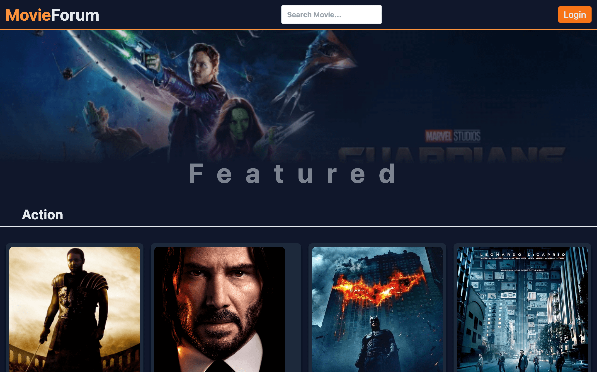
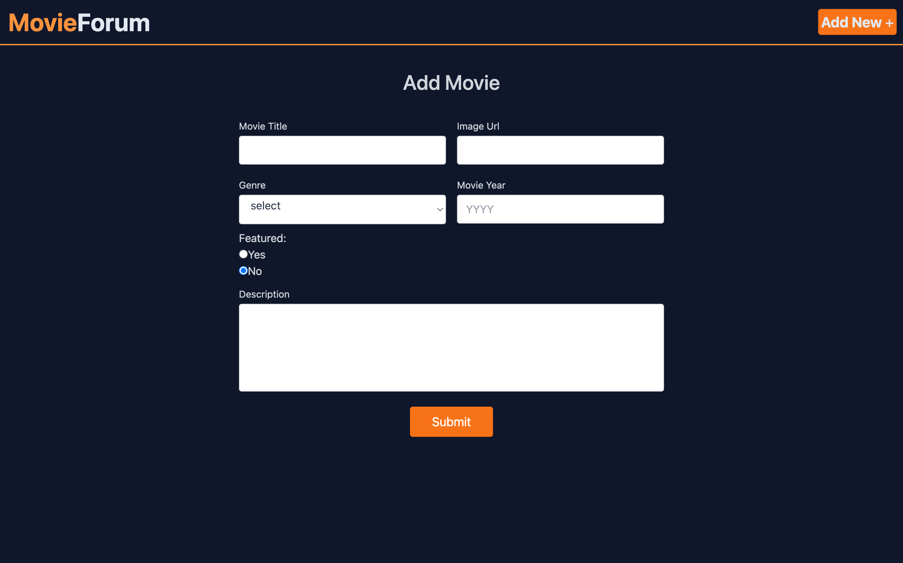
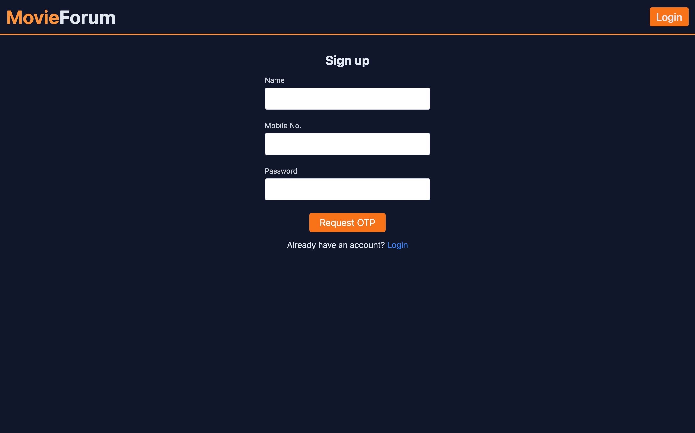

## MOVIE-FORUM REACT APP

**Tech Stack:** React, React-Router, Tailwind CSS, Firebase, Mobile Authentication

### Overview

The "MOVIE-FORUM REACT APP" is an ongoing project that began on 20th October 2023. It's a web application built using React and a variety of technologies to create a platform for users to share their thoughts and reviews on movies.

